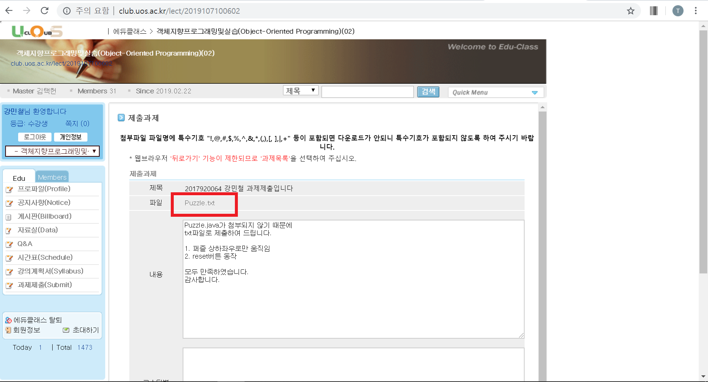

# URL Snapshot based Online IDE

## 요약

Source Code를 입력 및 실행할 수 있고, 10개 이상의 언어와 소스 다운로드 기능이 제공되는 Online IDE입니다. 타 Online IDE와 차별화되는 점은, 코드의 저장 및 제출에 있어 소스파일이 아닌, 
**코드를 담은 IDE의 URL** 을 저장한다는 점입니다. 
 
입력한 코드를 임시저장하게 되면, URL prefix에 고유 문자열 값이 생성되어 고유한 URL이 생성됩니다. 서버는 해당 URL만 저장/관리하면 되므로, 더욱 적은(정형화된) 용량의 데이터만 다루면 된다는 효용이 있습니다.

이 밖에도 질문답변/공지사항 게시판, 대외활동 및 개발자 대회 크롤링, 서울시립대 컴퓨터과학부  수업계획서/수업목록 API 등을 끌어와 완성도와 상품가치를 높였습니다.

[시연영상모음](https://github.com/kangtegong/online-judge-project/blob/master/demo/demo.md#%EC%8B%9C%EC%97%B0-%EC%98%81%EC%83%81
)

## 목차

1. [개발배경](https://github.com/kangtegong/online-judge-project#%EA%B0%9C%EB%B0%9C%EB%B0%B0%EA%B2%BD)
2. 개발효과
3. 기능
4. 설계
5. 한계

## 개발배경

### University of Seoul Online Judge (이하 UOS-OJ)의 실용적 목적과 연구 가치 
 
실용성이 떨어지는 프로젝트는 개발의 가치가 없고, 연구 가치가 없는 프로젝트는 양산형에 불과합니다. 따라서 본 프로젝트는 아래와 같은 실용적 목적과 연구적 가치를 모두 달성하기 위해 만들어졌습니다. 
 
### 연구적 가치 : "웹에도 포인터가 있다면, 그건 URL이 아닐까?"  
 
포인터와 URL은 물론 엄연히 다른 개념입니다. 하지만 비정형화된 크기의 데이터를 정형화된 데이터 크기로 관리할 수 있다는 점에서는 동일한 기능을 수행할 수 있을 거라 생각했습니다. 
 
현재 개발자 본인이 운영하고 있는 웹 서비스가 몇 개 있는데, 웹 서버를 운영할 때 어려운 점 중 하나는  아무래도 데이터베이스 관리였습니다. 이용자들마다 업로드하는 파일의 크기가 다르고, 각기 다른 확장자를  각기 다른 제약조건별로 관리해야 하다는 점에서 많은 예외들이 생겨나기 때문입니다. 
 
예를 들어 소스코드를 제출하는 사이트를 운영할 때, 누군가는 10000줄의 소스를 담은 코드를 제출하고 누군가는 10줄을 담은 코드를 제출합니다. 또 비슷한 크기의 파일을 제출하더라도 누군가는 python파일을,  또 누군가는 C, Java를 제출하기 때문에 (일일이 최대 업로드 바이트 수를 지정하고, 그에 대한 예외를 만들고, 업로드가 어려운 확장자에 대한 처리를 해야 하는 등) 운영에 있어 고려해야 할 점이 많았습니다. 
 
때문에 데이터베이스에 정해진 크기의 데이터를 저장할 수 있다면, 즉, 마치 C언어의 포인터처럼,  내가 찾고자 하는 데이터가 어디에 있는지에 대한 정보만을 저장한다면 정해진 크기의 데이터, 더욱 작은 크기의 데이터로 각기 다른 이용자들의 데이터를 관리할 수 있을 것이라는 아이디어 하에 본 프로젝트를 진행하게 되었습니다.

### 실용적 가치 :기존 플랫폼에 대한 문제의식 
 
컴퓨터과학부는 과 특성상 코드를 제출하는 과제가 많습니다. 하지만 기존에 학우들이 사용하던 [에듀클래스]에는 소스코드를 업로드할 수 없고, 업로드한 파일 형식에 맞지 않게 다운로드 되는 문제가 있었습니다. 그래서 [에듀클래스]를 아예 이용하지 않거나, 교수님들 별로 각기 다른 과제/공지사항 플랫폼을 마련하는 경우도 있어 왔습니다. 

기존 플랫폼의 업로드 이슈

수업 별 다른 플랫폼 이용 사례

또한, 코드를 제출하는 과제는 일반 문서(보고서)를 제출하는 과제와는 달리 다음과 같은 특수성이 있습니다. 
 
> 1. 제출자와 검수자 모두 소스코드를 실행할 수 있는 환경이 구축되어 있음을 전제로 한다. 
> 2. 각자의 환경에 따라 각기 다른 결과가 나올 수 있다. 
> 3. 제대로 된 (실행되지 않는) 소스가 아님에도 검수자는 이를 캐치하지 못하는 경우가 종종 있다.  
 
때문에 굳이 코드 구동 환경을 마련하지 않아도 되는, online IDE 기반의 과제 채점/제출 사이트를 개설한다면  학생과 교수님 모두의 입장에서 컴퓨터과학부의 과제 제출과 검수 및 관리가 편해질 것이라는 생각에 본 프로젝트를 시작하게 되었습니다. 

## 개발효과

### 1. 과제의 효율적 관리 및 검수
 
바로 실행이 가능한 IDE의 URL을 넘겨줌으로써 과제 제출자의 입장에서도, 과제 검수자의 입장에서도 효율적인 과제관리가 가능해집니다. 또한 다양한 확장자 (사실상 모든 종류의 확장자)에 대한 업로드/다운로드 기능을 비롯한 기존 에듀클래스의 한계를 모두 보완하였기 때문에, 통일된 과제 제출 플랫폼이 생길 수 있을 것으로 기대합니다.   

 UOS-OJ는 40여개의 (버전 별)언어를 지원합니다. 그리고 이 각기 다른 많은 언어들에 대해 개발환경을 설정할 필요가 없습니다. 그렇기 때문에 제출자와 검수자의 개발환경이 달라 다른 결과가 나오는 일이 없고, 제출자가 과제 채점에 있어서의 예외를 줄일 수 있기 때문에 과제에 대한 빠른 검수가 가능합니다.  
 
### 2. 효율적인 DB관리 가능 
 
또한 각 언어에 대한 실행은 물론, 각 언어의 확장자 별 다운로드도 가능합니다. 자신이 작성한 코드를 저장하고 싶을 때, 해당 URL만 저장하면 되므로 서버 관리자의 입장에서도,  이용자의 입장에서도 편리합니다. 
 
### 3. QnA 과정에서 온라인 상으로 바로 다운로드/실행 가능한 소스코드를 URL로 표현 가능 
 
기존 수많은 프로그래밍 QnA 사이트 (e.g. stackoverflow, 생활코딩 등) 는 프로그래밍 질문에 대한 답변을 직접 손으로 치며 단순히 문자열로 남겼습니다. 
 
하지만, UOS-OJ를 이용한다면, QnA에 대한 답변조차도 질문자와 답변자가 URL을 남겨주기만 하면 바로 실행가능/다운로드 가능한 소스코드를 주는 셈이 됩니다.

## 기능

## 설계

## 한계
단독개발에 개발기간이 부족해서 프론트가 엉망이다.

